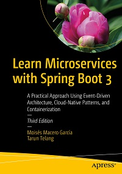

# Apress Source Code

This repository accompanies [*Learn Microservices with Spring Boot 3 3rd ed.*](https://www.link.springer.com/book/10.1007/978-1-4842-9757-5) by Moisés Macero García and Tarun Telang (Apress, 2023).

Please access the authors' github repo for the full source code: https://github.com/Book-Microservices-v3

[comment]: #cover

Download the files as a zip using the green button, or clone the repository to your machine using Git.

## Releases

Release v1.0 corresponds to the code in the published book, without corrections or updates.

## Contributions

See the file Contributing.md for more information on how you can contribute to this repository.
